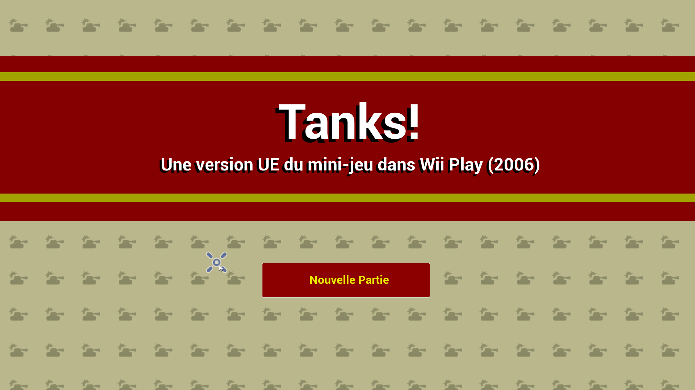
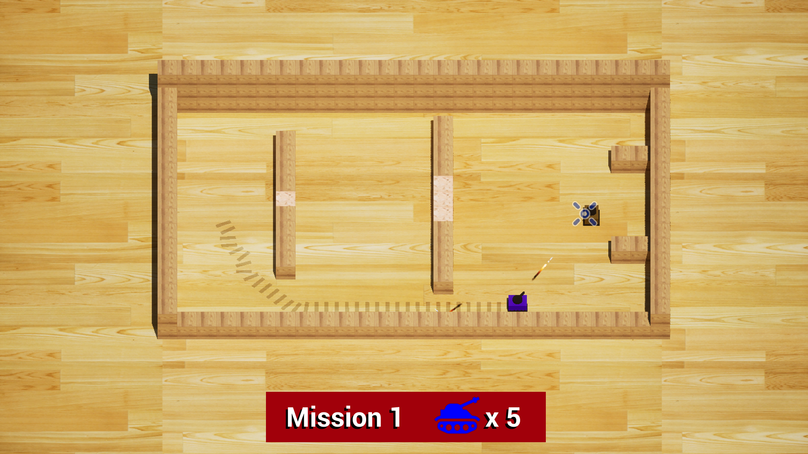
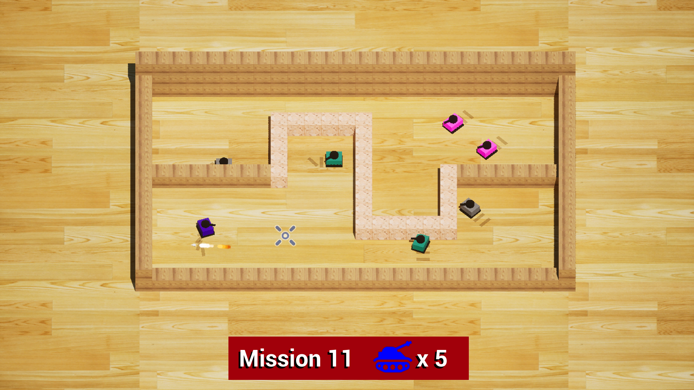
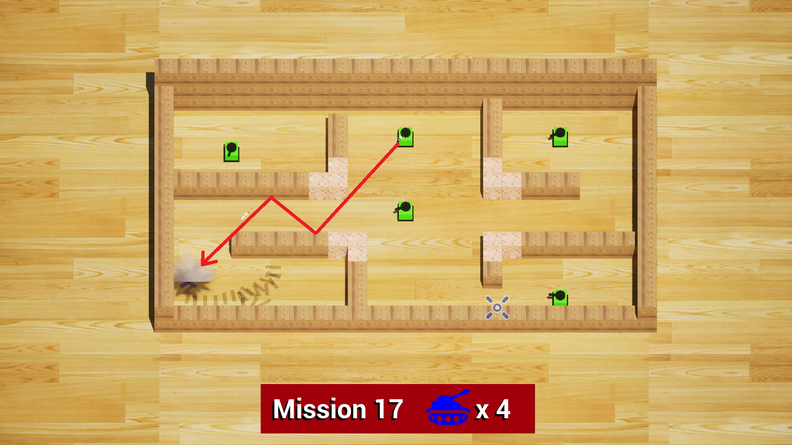
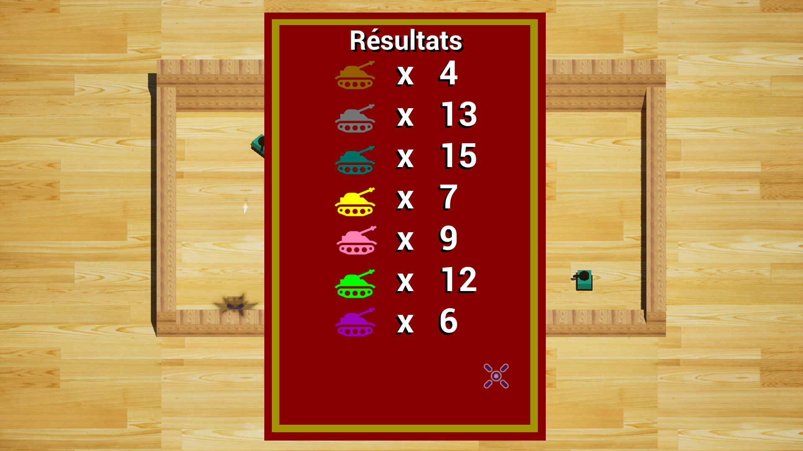

# Unreal Tanks

Ceci est mon projet scolaire que j'ai fais en seulement un mois pour démontrer ce que je pouvais faire dans une temps rapide dans Unreal Engine 5, et j'ai choisi de recréér le jeu "Tanks!" de Wii Play (2006). Le jeu original est simple. Tu joue comme un tank bleu, et ton but est de détruire tous les tanks de d'autre couleures pour passer au prochain niveau. Le jeu original était fait pour démontrer les contrôles de la manette Wii et le Nunchuck, mais ma version est adaptée pour WASD et une souris.

## But du Jeu & Contrôles

Ce jeu a 20 niveau. Chaqun étant plus difficile que le dernier. Ils consistent de différents types d'ennemis placés dans des arènes avec une variété d'obstacles. Tu bouges ton tank avec WASD, et tu tires avec la souris. Tu mets ton curseur sur ta cible, et en cliquant, le tank va tirer dans cette direction. Tes tirs peuvent rebondir jusqu'à une fois sur les murs avant d'exploser. Tu peux aussi placer des mines avec le bouton E, et ils exploseront peu après qu'un autre tank se rapproche, ou après 10 secondes.

Tu commences avec 4 vies, et le jeu est fini dès que tu te fait tuer avec 0 vies restantes. Tu reçoit une vie de plsu après chaque 5 niveaux, mais c'est tout. Si tu meurt à un niveau, tout les ennemis reviendront en vie, donc tu doit tout faire d'un coup.

## Types d'Ennemis & Obstacles

Les tanks ennemis viennent dans une variété de couleures, et chaque a des charactéristiques différentes.

- Les bruns ne bougent pas, et ne tirent pas beaucoup
- Les gris essayent toujours de se cacher de toi pour se protéger eux-mêmes
- Les aquamarines sont lents, mais leurs tirs sont rapides
- Les jaunes aiment places des mines
- Les roses bougent plutôt vite et aiment courrir autour de toi
- Les vert pâles ne bougent pas, mais sont très intelligents et savent où tirer pour t'attraper de loin
- Les mauves se promènent beaucoup en laissant derrière eux des bombes
- Les blancs sont invisibles, et doivent êtres repérés avec leures traces
- Le noir sont rapides, forts, et intelligents

Il éxiste aussi plusieurs types d'obstacles.

- Les blocs sont les murs du niveau, tu peux les utiliser pour te cacher des tirs ennemis, ou pour faire rebondir tes tirs à toi.
- Les blocs destructibles agissent comme des blocs normaux, mais peuvent êtres détruits avec une mine. Ils offrent des passages de plus dans les niveaux
- Les trous sont impassables pour les tanks, mais tes tirs et ceux des ennemis peuvent passer par dessus, alors fait attention!

## Choses différentes du jeu original

Il y a plusieures modifications d'aspect que j,ai fait au jeu original en le recréant sur Unreal. La plupart était coupés car je n'avais pas de temps, mais certains étaient intentionels.

Dans le jeu original, tu ne pouvait pas bouger dans une direction avant que ton tank soit tourné vers cette direction. Cela veut dire que si tu voulait tourner, il fallait attendre un quart de seconde avant que tu change de direction. J'haïssait cela. Dans ma version, tu peux bouger dans n'importe quelle des 8 directions n'importe quand, même si l'angle du tank ne fait pas trop de sens. Le gameplay est plus important que le réalisme.

Le jeu original est intéressant dans l'aspect musical. La musique est très dynamique, et dépend fortement des types d'ennemis restants, ainsi que leur nombre. Je n'avais pas assez de temps pour recréér cela, alors ma version contient seulement la toune de base.

Dans le jeu original, le Tanks plus intelligents sont capables de calculer ou tu seras dans X temps, et tirer où tu seras. Je voulais implémenter cela, mais les tirs sont tellements lents que c'était vraiment impratique de calculer où tirer, surtout si le joueur était caché et l'ennemi devait tirer sur un mur pour faire rebondir le tir. Donc, dans mon jeu, les tanks peuvent seulement tirer où tu es.

## Aspect Technique

J'ai fait le choix de seulement utiliser le code "Blueprint" pour créér mon jeu, pour une variété de raisons.

1. Je voulais voir si je pouvais y arriver sans utiliser du C++
2. J'était plus familier avec les blueprints que le C++
3. J'avais de mauvaises experiences quand cela venait à essayer de compiler des projets Unreal qui utilisaient du C++

À part cela, je suis plutôt fiers de ce que j,ai implémenter comme maths dans mon jeu. Les tirs rebondissent correctement, le modèle des tanks pointent vers où ils bougent en tournant dans la direction la plus optimale (ce qui était plutôt difficile à calculer!) et mon aspect technique préféré, les ennemis plus intelligents savent où tirer pour frapper le joueur si il est derrière un mur. Ils savent combient de fois leurs tirs peuvent rebondir, et calulent la première trajectoir qui réussit à frapper le joueur. Il fallait que j'implémente plusiueres techniques par-dessus cela pour que ce soit plus efficace et que le FPS de mon jeu reste stable, mais j'ai réussi.

Ceci est une image de avant que j'ai implémenté des améliorations à l'algorithme, mais elle démontre ses capabilités. Les lignes vertes correspond aux angles non bloqués par des obstacles. SI le joueur touche à une des lignes vertes, l'ennemi peut lui tirer.

## Images du Jeu

